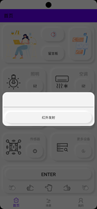

This is the description about applications of my Smart Home Control System..  

Here's the translation into English:

**Control Center**

- **Control Center:** Records data collected by sensor units, uses pre-trained models for intelligent scene switching.
- **Management Center:** Used for recording information about smart devices in each room.

**Client:**

- User login and control using interaction methods including air gestures.
- Viewing and controlling information about home appliances.
- Switching of smart scenes.
- Door lock operation and remote unlocking.

**Smart Door Lock Application:**

- Remote control of door lock.
- Inquiry and management of lock status.

Here's the translation of the provided text into English:

**① Function Interface**

In the application, we have set up three interfaces: "Home", "Scene", and "My", according to different functions. Below is an introduction to the functions of these three interfaces.

- **"Home"**

  In the "Home" interface, we have set up functional modules and buttons as shown in Figure 4.4. The areas in red boxes in the figure can be operated using air gestures or by direct clicking. Table 4.1 specifically introduces the functions controlled by these buttons.
  
  

                  

图4.4 首页界面

表4.1 系统模块组成

| **按钮名称**     | **功能**                                                     |
| ---------------- | ------------------------------------------------------------ |
| 刷新按钮         | 用于设备信息刷新                                             |
| 留言板按钮       | 用户显示设备信息                                             |
| 数据图表按钮     | 跳出弹窗，显示一天24小时开灯时长，一周睡眠时长等可视化数据信息 |
| 照明弹窗按钮     | 跳出弹窗，实现室内区域与灯源设备可选，具有一键全关与一键全开功能 |
| 空调弹窗按钮     | 跳出弹窗，显示设定温度，实现室内区域可选，温度，模式，风力，开关调节，同时具有一键全开与一键全关功能 |
| 红外弹窗按钮     | 跳出弹窗，在输入框内输入指令，命令中控端依据指定的代码发射对应的红外指令 |
| 门锁弹窗按钮     | 跳出弹窗，功能通过cardview进行划分，可选择目标设备，具有密码/密钥修改功能，可生成一次性临时密码，数据传输过程采用AES加密，设备可重命名 |
| 传感器弹窗按钮   | 跳出弹窗，显示室内传感器数据                                 |
| 更多设备弹窗按钮 | 跳出弹窗，通过recyclerview实现设备可拓展性                   |
| 手势交互进入按钮 | 用于进入手势操控功能，适用于某些不方便触摸屏幕的特殊场景     |

  其中，照明弹窗按钮在系统中实现照明设备管理的过程在图4.5中具体展现。简要来说，通过点按应用程序中的照明弹窗按钮，在应用程序弹窗进行的操作会经过系统建立的家居局域网络，以指令形式转发到智能控制中心，经过中心的转发后到达照明设备。

 

图4.5 照明设备控制流程图与弹窗界面

空调设备在应用程序中的弹窗进行的设置以及经过的过程同理。图4.6 具体显示了空调控制指令经过的流程以及弹窗效果。

图4.6 空调设备控制流程图与弹窗界面

红外设备在应用程序中的弹窗进行的设置以及经过的过程同理。图4.7 具体显示了红外设备的控制指令经过的流程以及弹窗效果。并且红外设备控制指令在经由智能控制中心转发，在局域网传输到设备后，需要又设备位置的红外编码单元转译成红外信号。

图4.7 红外设备控制流程图与弹窗界面

门锁设备的管理与控制在应用程序以及系统网络中经过的过程与空调类似，由应用程序设置的密码或生成的临时密码，经过AES加密算法加密后，经过智能控制中心在局域网中转发到门锁设备上，更新门锁设备相关信息。图4.8 显示了具体的控制流程以及弹窗。

图4.8 门锁设备控制流程图与弹窗界面

传感器设备的控制过程稍有不同。图4.9 显示具体控制过程。出于用户数据安全性以及客户端应用程序大小限制的考虑，传感器单元记录的数据经过系统局域网保存在用户家居本地智能控制中心中。在点按传感器弹窗按钮后，请求智能控制中心，将数据经过局域网发送到用户的客户端上，以弹窗形式显示。

图4.9 传感器设备控制流程图

图4.10 传感器按钮弹窗界面

留言板按钮进行的操作请求，在系统中经过的流程与传感器设备按钮经过的流程类似。不同客户端的留言信息均保存在智能控制中心中。当按钮按下时，请求执行也被发送到智能控制中心。图4.11 显示留言板请求具体经过的流程以及弹窗界面情况。

图4.11 留言板请求流程以及弹窗界面

数据请求按钮主要请求智能控制中心中保存的设备使用时常以及家居相关参数（温度、光照等）。获得的数据以小时为单位显示在柱状图上，使得数据更为直观。图4.12 显示数据弹窗请求具体经过的流程以及弹窗界面情况。

图4.12 数据弹窗请求流程以及弹窗界面

l “场景”

在“场景”中，我们设置了图4.13 显示的功能模块与按钮。图中红色方框区域为可以使用空中手势或是直接点击的按钮，右侧显示了不同场景下可以设置的设备类型以及相应的功能。

图4.13 “场景”界面效果图

在点按以上四个按钮后，应用程序向系统网络发送指令，由智能控制中心接收并转发到相应的智能家居设备执行。对于每个设置的具体场景，系统智能谢欢的具体过程在4.4节进行了具体的介绍。图4.14 显示了场景执行按钮指令在系统中的具体流程。

图4.14 场景执行指令具体流程图

l “我的”

在“我的”中，我们设置了图4.15 显示的功能模块与按钮。图中红色方框区域为可以使用空中手势或是直接点击的按钮，右侧显示了不同按钮的名字。

图4.15 “我的”界面效果图

表4.2 系统模块组成

| **按钮名称** | **功能**                                                     |
| ------------ | ------------------------------------------------------------ |
| 头像按钮     | 用于用户信息设置                                             |
| 网关管理按钮 | 用户设置网关信息                                             |
| 手势手册按钮 | 给用户提供手势交互的指南                                     |
| 账号切换按钮 | 用户用户账号管理                                             |
| 房间切换按钮 | 底部使用彩色view分区，代表了室内不同房间。点击后以弹窗显示不同房间中存在的设备以及相关信息 |

②  交互设计

在应用程序的交互设计中，我们主要从交互模式行为以及用户操作流程与导航两个方向进行考虑。下面是对这两个方向具体的设计介绍。

l 用户交互模式和行为

在交互模式方面，主要包含三个要点。首先，是功能触发方面。用户在触发功能时，我们提供了点按按钮、滑动进度条以及手势控制等操作触发应用程序的相关功能。其次，用户的每次交互均需要有效的交互反馈。应用程序中，我们设计了按钮点击音效，并且添加了按钮按下与弹起的视觉反馈，从不同模态给与用于及时的反馈。最后是用户习惯。我们根据项目组成员的生活经验以及对周围同学和潜在用户的采访，设计的界面有着功能集中、弹窗范围合理的优点。

l 用户操作流程和导航

在这个方面，主要包含三个要点。首先，是导航结构。我们采用经典且有效的底部导航栏，实现三页面切换的功能。其次，用户的操作流程需要尽量简洁。我们尽最大可能封装指令流程，减少用户的相应负担。最后，用户在操作时候我们提供了详细的指引。从触摸交互方式时，用户看到的添加阴影的按钮到手势交互时，界面下方手势图例栏，均在为用户的操作提供尽可能直观的指引。

